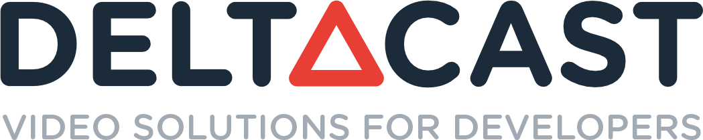
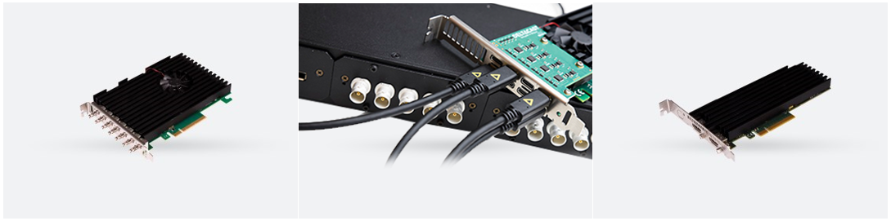
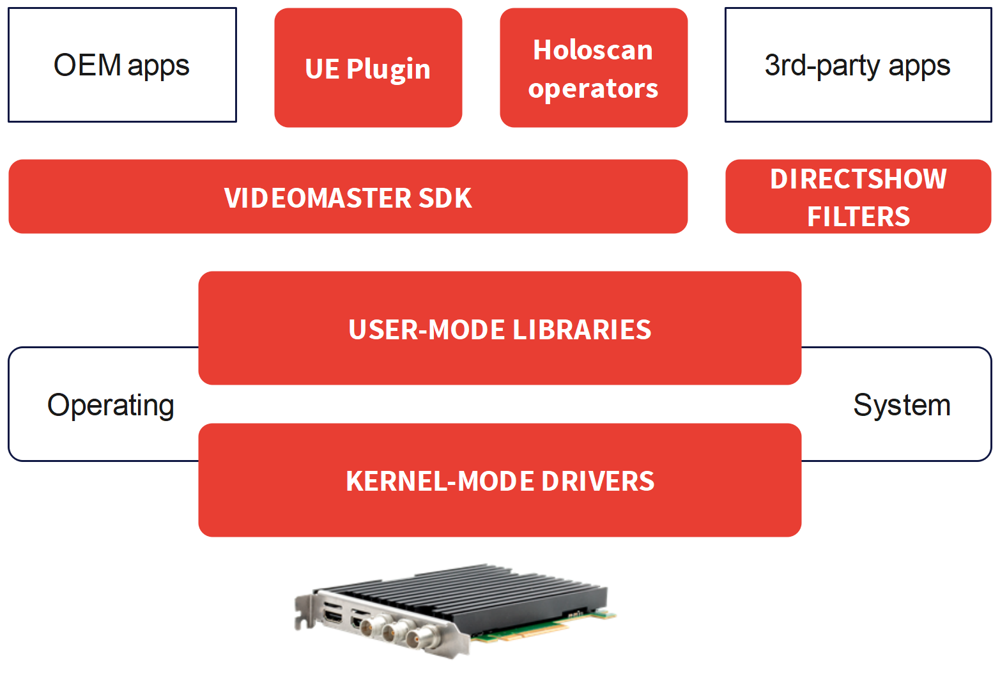
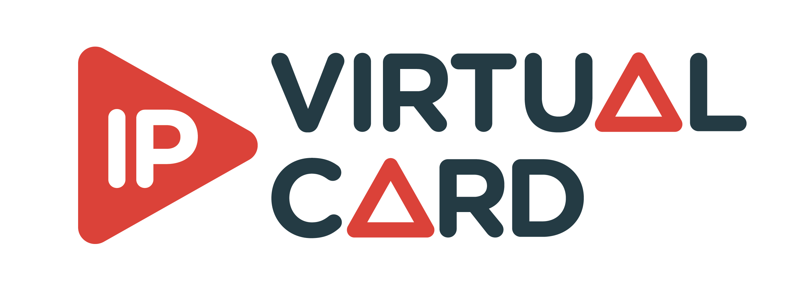

# Who is DELTACAST?

   <picture>
      <source media="(prefers-color-scheme: dark)" srcset="./img/deltacast_logo_darkmode.png">
      
   </picture>

We are a Belgian company designing and selling hardware and software video products.

DELTACAST devices and software components mainly intend to bring in video connectivity to high-end and professional applications, under the form of PCI Express interface cards or under the form of software components for Video of IP.

DELTACAST video I/O products sit in computer systems used in TV broadcasting, digital cinema production, live events, corporate broadcasting, e-sports, medical video systems, industrial vision appliances, and many more!

Learn more on <a href="https://www.deltacast.tv">www.deltacast.tv</a>.

# What is DELTACAST VideoMaster?

<b>VideoMaster</b> is the software environment allowing the usage of <a href="https://www.deltacast.tv/products/developer-products">DELTACAST video I/O cards and FLEX solution</a> on Windows, Linux and macOS computer platforms.

   

DELTACAST PCIe boards and FLEX modules provide video I/O connectivity in SDI, HDMI, DisplayPort, ASI, IP to computer-based application.

<b>VideoMaster</b> is essentially composed of drivers and libraries implementing the interface between the DELTACAST hardware, the platform and the operating system, as well as low-level features and video processing. That core software bundle is also surrounded by a series of components made to use the DELTACAST I/O cards in specific software frameworks and applications: Directshow filters, Unreal Engine plugin, Nvidia Holoscan operators, …

The VideoMaster software environment also includes a <a href="https://www.deltacast.tv/products/developer-products/software-development-kit/videomaster-oem-sdk">software development kit (SDK) for developers</a>. The <b>VideoMaster SDK</b> allows OEMs and 3rd-party applications developers to make use of DELTACAST I/O boards to bring in video connectivity to their designs.

   

# What is DELTACAST VideoMasterIP?

<b>VideoMasterIP</b> is the software part of the <a href="https://www.deltacast.tv/products/developer-products/ip-software/ip-virtual-card-smpte-st-2110-edition">IP Virtual Card</a> concept.

   
   <picture>
      <source media="(prefers-color-scheme: dark)" srcset="./img/ipvc_logo_darkmode.png">
      
   </picture>

The IP Virtual Card is a high-performance video streaming solution allowing to use COTS network cards to ingest and playout uncompressed video up to 4K as per SMPTE ST 2110.

The IP Virtual Card is available under Windows and Linux. It is provided as a set of software libraries and low-level components protected by runtime licenses and coming with a Software Development Kit (SDK) to develop computer-based ST 2110 video processing solutions.

# How to get VideoMaster and VideoMasterIP software?

The VideoMaster software installers for Windows, Linux and macOS, as well as the DELTACAST Directshow filters, are freely available onto the DELTACAST download center at :

   <a href="https://www.deltacast.tv/support/download-center">https://www.deltacast.tv/support/download-center</a>

Under the “Documentations” section, the download center also hosts installation and cabling guides of all the DELTACAST products. Please carefully follow the instructions in these guides.

The VideoMasterIP software installers are also available, together with dedicated documentation, onto the DELTACAST download center at:

   <a href="https://www.deltacast.tv/support/download-center">https://www.deltacast.tv/support/download-center</a>

To obtain a runtime license needed to execute the IP Virtual Card software components, please contact us at <a href="contact@deltacast.tv">contact@deltacast.tv</a>, or register yourself onto <a href="https://www.deltacast.tv/contact">https://www.deltacast.tv/contact</a>.

If you are a developer and wish to obtain the VideoMaster SDK or the VideoMasterIP SDK, you will also need to contact our staff at  <a href="contact@deltacast.tv">contact@deltacast.tv</a>, or register yourself onto <a href="https://www.deltacast.tv/contact">https://www.deltacast.tv/contact</a>.

# What is hosted on GitHub?

The above mentioned VideoMaster and VideoMaster IP Software Development Kits contain tons of sample projects demonstrating the individual usage of DELTACAST products, features and working modes.

To complete your developer toolkit, you will find here : 
-	Higher-level applications combining multiple features. They can be used as-is, or they can constitute good foundation for your own project
-	Resources for the integration of DELTACAST product in 3rd party software frameworks, like Nvidia Holoscan and Unreal Engine
-	Some free-to-use video utilities
